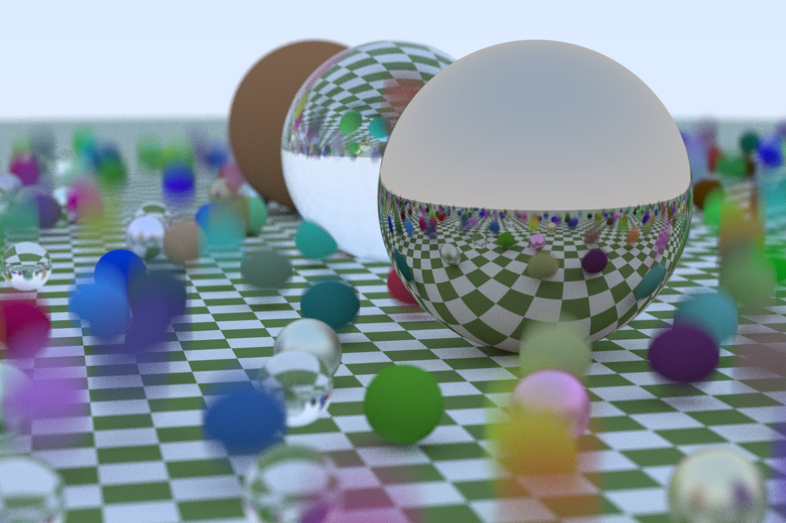

# sidewinder

CPU ray tracer based on
[Ray Tracing in One Weekend](https://raytracing.github.io/books/RayTracingInOneWeekend.html) (C++).




# Usage

```sh
USAGE:
    sidewinder [OPTIONS] [PATH]

ARGS:
    <PATH>    Output path

OPTIONS:
    -d, --depth <MAX_DEPTH>              Diffuse reflection recursion depth [default: 50]
    -f, --force                          Overwrite existing files
    -h, --help                           Print help information
    -r, --aspect-ratio <ASPECT_RATIO>    Image aspect ratio [default: 1.5]
    -s, --samples <SAMPLES_PER_PIXEL>    Antialiasing samples per pixel [default: 100]
    -V, --version                        Print version information
    -w, --width <IMAGE_WIDTH>            Image width [default: 400]
```
